# Assignment #3. Responsive Web Design (Media Queries + Bootstrap Grid)

**Name:** Ingkar Tolegen
**Group:** SE-2540
**Course:** Web Technologies 1 — Frontend
**University:** Astana IT University

---

## 📌 Objective

The goal of this assignment was to learn how to create responsive web pages using **CSS Media Queries** and the **Bootstrap Grid System**. The final result is a portfolio page that automatically adjusts to mobile, tablet, and desktop screens.

---

## 📂 Project Structure

Assignment8_WEB1/

|___index.html #Task4 - Portfolio Page

|___task0.html #Task0 - Responsive Typography

|___task1.html #Task1 - Responsive Layout

|___task2.html #Task2 - Bootstrap Responsive Columns

|___task3.html #Task3 - Bootstrap Navigation Bar

|___css/

| |_____bootstrap.min.css

| |_____style.css #Custom styles + media queries

|___js/

| |_____bootstrap.bundle.min.js

|___images/ #Screenshots and project images

---

## Part 1. Media Queries

### Task 0. Responsive Typography

A simple page with headings and paragraphs. Font sizes change for mobile, tablet, and desktop using CSS media queries.

**Mobile (small font):**
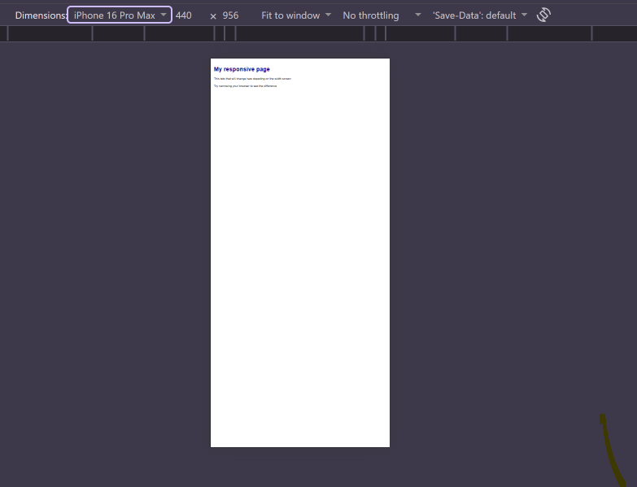

**Tablet (medium font):**
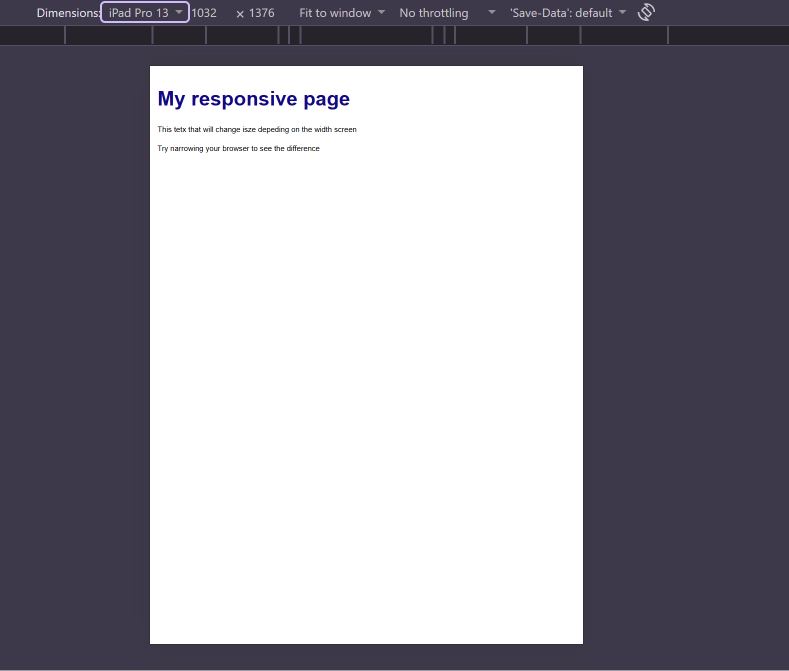

**Desktop (large font):**
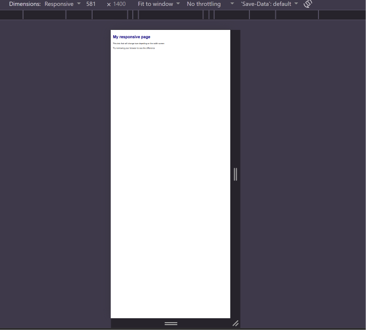

---

### Task 1. Responsive Layout with Media Queries

A page with three boxes that rearrange based on screen size using only CSS media queries (no Bootstrap).

- Mobile: boxes stacked vertically.
- Tablet: two boxes per row.
- Desktop: three boxes in a row.

**Mobile:**
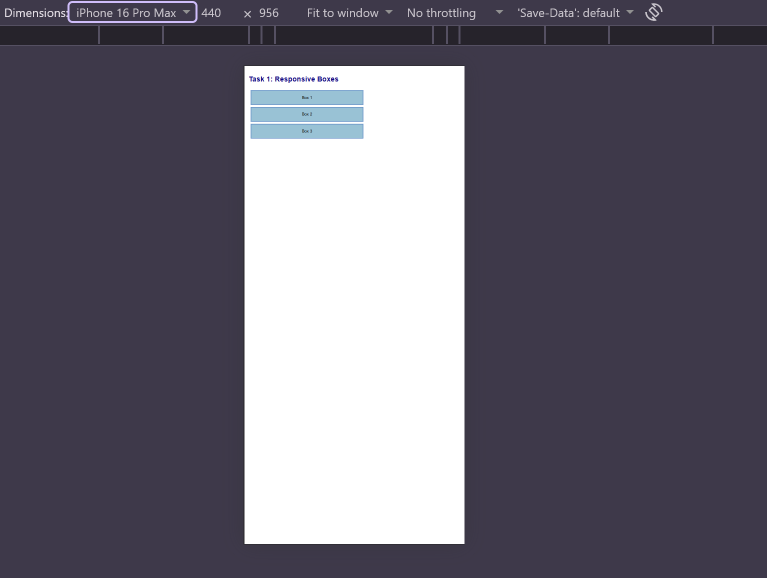

**Tablet:**
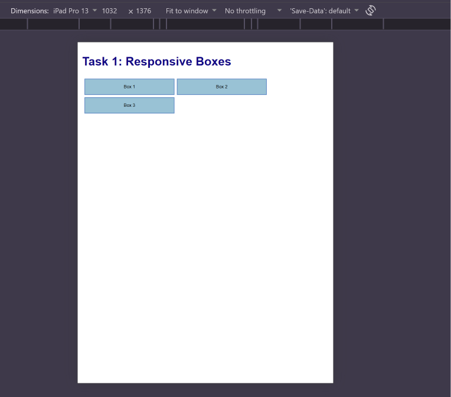

**Desktop:**
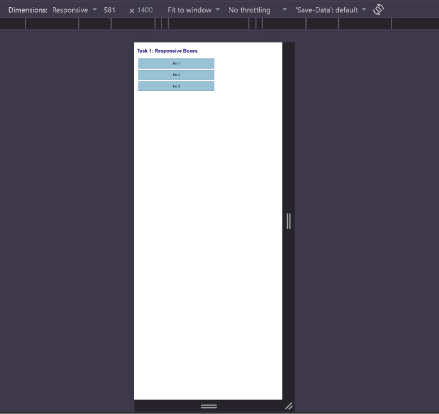

---

## Part 2. Bootstrap Grid System

### Task 2. Bootstrap Responsive Columns

A three-column layout using Bootstrap's 12-column grid.

- Mobile: all columns stacked (`col-12`).
- Tablet: two columns per row, third wraps to the next row (`col-md-6`).
- Desktop: three equal columns in one row (`col-lg-4`).

**Mobile:**
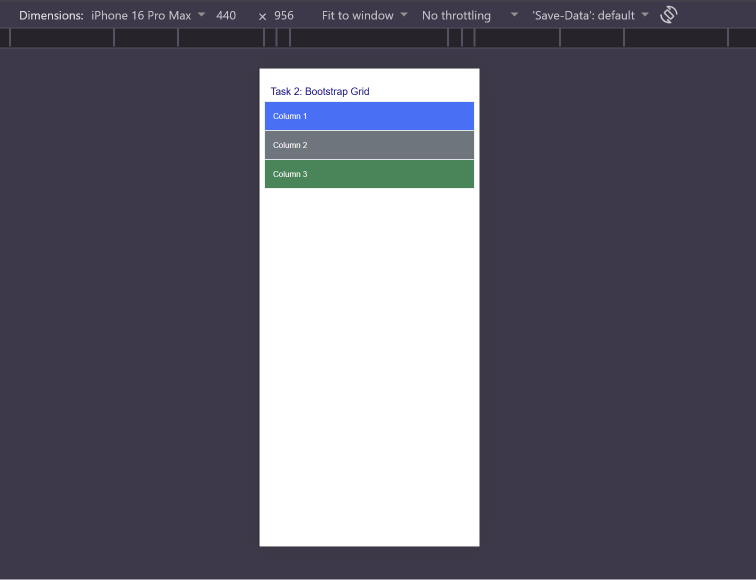

**Tablet:**
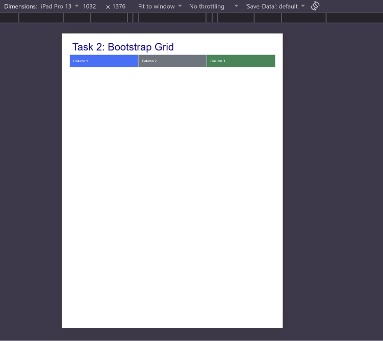

**Desktop:**
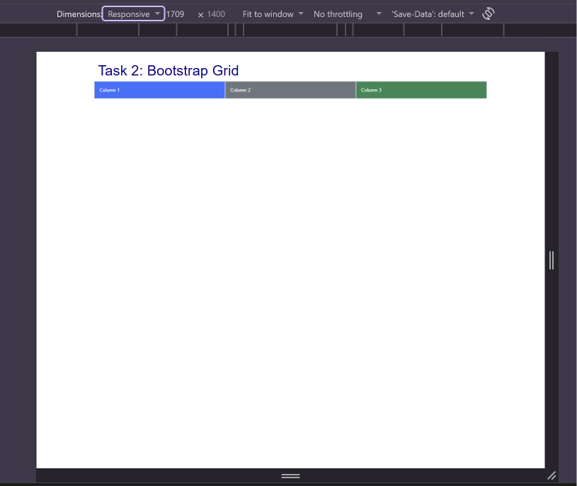

---

### Task 3. Bootstrap Navigation Bar

A responsive navbar with a logo on the left and links on the right. On smaller screens, the menu collapses into a hamburger button.

**Mobile (hamburger menu):**
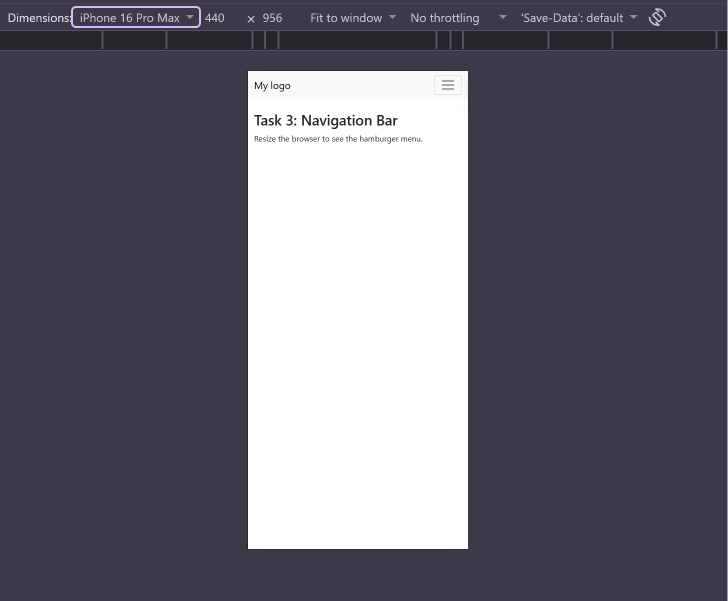

**Desktop (expanded):**
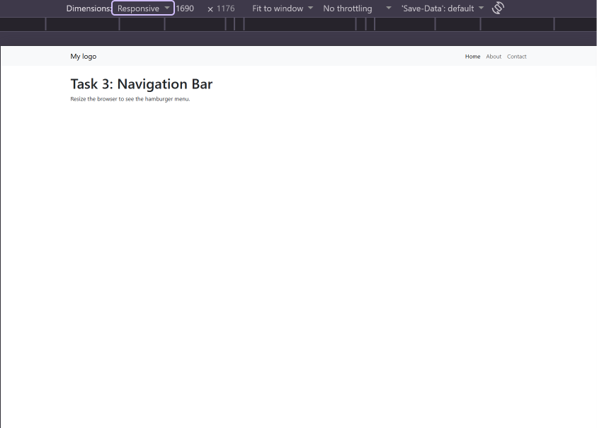

---

## Part 3. Combined Project

### Task 4. Responsive Portfolio Page

A complete portfolio page combining **Media Queries + Bootstrap Grid**.

**Structure:**
- **Header:** Bootstrap navbar with logo and links.
- **Main section (2 columns on desktop):**
  - Left side: portfolio projects arranged with Bootstrap cards.
  - Right side: sidebar with personal info and contact details.
- **Footer:** full-width dark footer.

**Responsive behavior:**
- On mobile: cards stack vertically, sidebar moves under the cards, navbar collapses into a hamburger.
- On tablet: cards are two per row, sidebar is still below.
- On desktop: cards are in a 2×2 grid on the left, sidebar on the right.

**Mobile:**
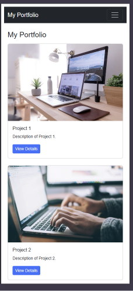

**Tablet:**
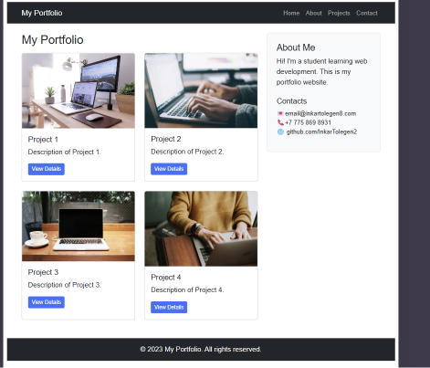

**Desktop:**
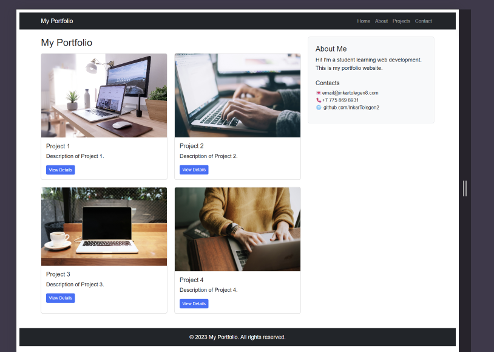

---

## 🧠 Summary

During this assignment, I learned how to:

- Use **CSS Media Queries** to change styles depending on screen width.
- Build responsive layouts with the **Bootstrap 12-column grid**.
- Connect Bootstrap locally (`bootstrap.min.css` and `bootstrap.bundle.min.js`).
- Create a **collapsible Bootstrap navbar** with a hamburger menu.
- Combine **Bootstrap Grid + custom media queries** for flexible, mobile-first layouts.
- Organize project files into `css/`, `js/`, and `images/` folders.

**Challenges I faced:**
- Bootstrap did not load at first because the page was opened via `file:///`. Solved by using **Live Server**.
- Media queries worked correctly only when the `<meta name="viewport">` tag was present.

**Result:** A fully responsive portfolio page that works on mobile, tablet, and desktop screens.

---

## 🔗 Links

- GitHub Repository:https://github.com/InkarTolegen2/Assignment3_WEB1.git
- Bootstrap Docs: https://getbootstrap.com/docs/5.3/
- Task 0: [https://inkartolegen2.github.io/Assignment3_WEB1/task0](https://inkartolegen2.github.io/Assignment3_WEB1/task0)
- Task 1: https://inkartolegen2.github.io/Assignment3_WEB1/task1
- Task 2: https://inkartolegen2.github.io/Assignment3_WEB1/task2
- Task 3: https://inkartolegen2.github.io/Assignment3_WEB1/task3
- Task 4: https://inkartolegen2.github.io/Assignment3_WEB1/
